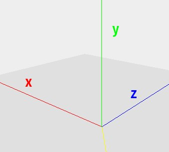

Since we want everything to be in sync, both time- and space-wise, a single coordinate system for everything is a must.

We decided that it would be best to go with Cartesian coordinates `x, y, z`, where the y-axis is vertical; and by default (in the home position), the camera points towards the z-axis.

The image below shows how our coordinate system looks like.

## Conversion between angles and vectors
In order to use the coordinates, we need to convert from the angles provided to us by the microphone and camera, to vectors. We want to avoid doing these conversions as much as possible to prevent inaccuracies, so we only do it twice: once after receiving the microphone information, and once before sending movement instructions to the camera.

### The microphone
The microphone provides us with two angles - the elevation between 0° and 90° (with 90° meaning the sound is coming from straight below the microphone) and the azimuth between 0° and 359° (with 0° being directed towards the logo, and the angle increasing when going clockwise). We decided that by default, the microphone should also point towards the z-axis, with both the elevation and the azimuth being zero. This position happens to occur when the "Sennheiser" logo on the Ceiling 2 is pointing away from the camera (aka. towards the z-axis).

We convert these two angles by calculating Cartesian coordinates from the polar ones (with distance 1), and reverse the x- and y-axes. We reverse the y-axis because the microphone points down and the x-axis because the angles increase clockwise (so an azimuth of 90° would point away from the x-axis).

If we label the azimuth as alpha and the elevation as beta, the formula for the resulting vector is $[-\sin{\alpha}\cos{\beta}, -\sin{\beta}, \cos{\alpha}\cos{\beta}]$.

### The camera
The camera also has two angles - the pan (-170° to 170° with the positive values being clockwise, i.e. away from the x-axis) and tilt (-30° to 90°). For translating to a vector, we use the same method as with the microphone, except we only reverse the x-axis. The formulate will be $[-\sin{\alpha}\cos{\beta}, \sin{\beta}, \cos{\alpha}\cos{\beta}]$ with alpha being the pan and beta being the tilt.

The conversion back to angles is non-trivial, since the vector $[0, 1, 0]$ means a tilt of 90° and every possible pan. However, we do not expect this to be a large problem since the camera will almost never have to point straight up in a lecture or conference scenario, and this is the only non-deterministic vector position (aside from the degenerate $[0, 0, 0]$, which does not occur).

We calculate the angles like so: the tilt is just the arcsine of the y-coordinate, and the pan is the cosine distance (dot product) between the projection of the original vector to the x-z-plane and the home vector $[0, 0, 1]$. If the x-coordinate value is positive, the angle is negated.

## Reasoning
The reason behind why we chose to invert the x-axis for both the microphone and the camera is so that we conform to the right-hand convention [1] followed by most people working with 3D coordinates (eg. computer graphics). There was a possibility to use a reversed x-axis for simplicity within the project, but then it would be harder to integrate with other projects or hardware.

[1] https://math.hws.edu/graphicsbook/c3/s2.html